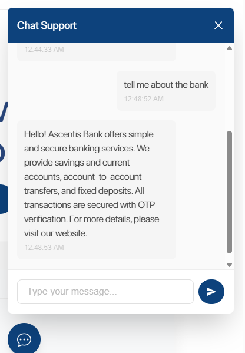

# 🤖 ChatBot-Backend

A conversational AI chatbot powered by **Google Generative AI**, designed to understand natural language queries and respond intelligently using a custom prompt and knowledge base.

> 🚀 Deployed at: [ascentis.bhaweshpanwar.xyz](https://ascentis.bhaweshpanwar.xyz)

---

## 🧠 Features

- ✨ Built using Google Generative AI (PaLM/Vertex AI)
- 📁 Custom knowledge base integration
- 🗣️ Context-aware conversation flow
- ⚡ Fast and lightweight backend (Node.js)
- 🔒 Secure API access and deployment

---

## 📁 Project Structure

```bash
ChatBot-Backend/
├── index.js                # Main server entry point
├── prompt.txt              # Custom prompt for chatbot context
├── knowledge_base.txt      # Local knowledge base file
├── package.json            # Dependencies and scripts
└── .gitignore              # Git ignored files
```

````

---

## 🔧 Installation

1. **Clone the repo**

   ```bash
   git clone https://github.com/bhaweshpanwar/ChatBot-Backend.git
   cd ChatBot-Backend
   ```

2. **Install dependencies**

   ```bash
   npm install
   ```

3. **Configure Environment**
   Create a `.env` file and add your API key:

   ```env
   GOOGLE_API_KEY=your_google_ai_api_key_here
   ```

4. **Start the server**
   ```bash
   node index.js
   ```

---

## 🖼️ Screenshots



---

## 🛠️ Tech Stack

- **Backend**: Node.js
- **AI Model**: Google Generative AI (PaLM or Gemini via API)
- **Hosting**: [ascentis.bhaweshpanwar.xyz](https://ascentis.bhaweshpanwar.xyz)

---

## 📌 TODOs

- [ ] Add frontend integration
- [ ] Add database for chat history
- [ ] Add user authentication
- [ ] Improve prompt flexibility with context injection

---

## 📬 Contact

Created by [Bhawesh Panwar](https://github.com/bhaweshpanwar) — feel free to reach out!

---

```

```
````
